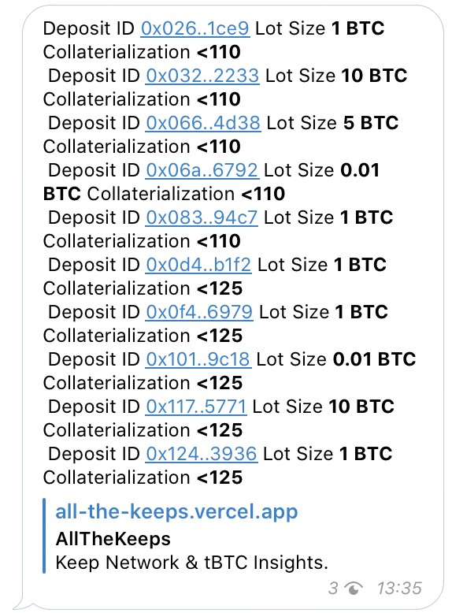
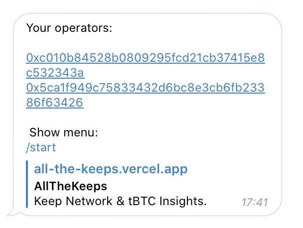
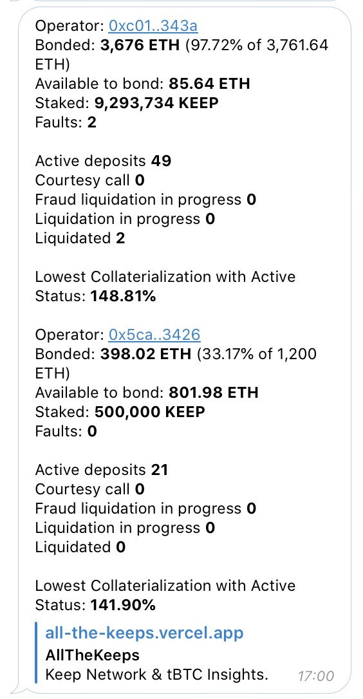
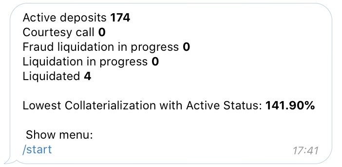

[Russian description](README.ru-Ru.md)

# [Telegram channel](https://t.me/tbtcliquidationsinfo)

Designed to receive instant information about changes in the statuses of deposits and their achievement of the Collaterialization thresholds for all deposits in the system

- provides general information about deposits once a day (15 UTC0)

- In the event of a change in the status of any deposit from the entire system (for example, if the deposit has moved from Active Status to Courtesy call), informs about it instantly

- In the event of a change in the % Collaterialization of any deposit from the entire system to the threshold values (currently 125% and 110%), informs about it instantly

# [Telegram bot](https://t.me/tBTC_Liquidationsbot)

Designed to receive instant information about changes in the statuses of deposits and their achievement of the Collaterialization thresholds for all deposits of selected operators

- In the event of a change in the status of a deposit belonging to any operator from the user's list (for example, if the deposit has moved from the Active status to the Courtesy call), informs about it instantly

- In the event of a change in the % Collaterialization of the deposit belonging to any operator from the user's list to the threshold values (currently 125% and 110%), it immediately informs about it

## Commands 

- /start - Displays the main menu

- /operator_list - Lists the user's operators

- /add_operator - Add operator to list
- /remove_operator - Remove operator from list
- /operators_info - Get brief information on user operators

- /deposits_info - Get general information about deposits in the system

- /statistics_on - Subscribe to the daily (at 15 UTC + 0) newsletter about the state of the operator and deposits
- /statistics_off - Cancel subscription

# Discord bot

- gives general information about deposits

- gives general information about the operator 

