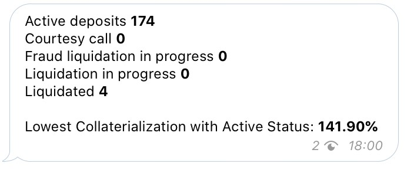
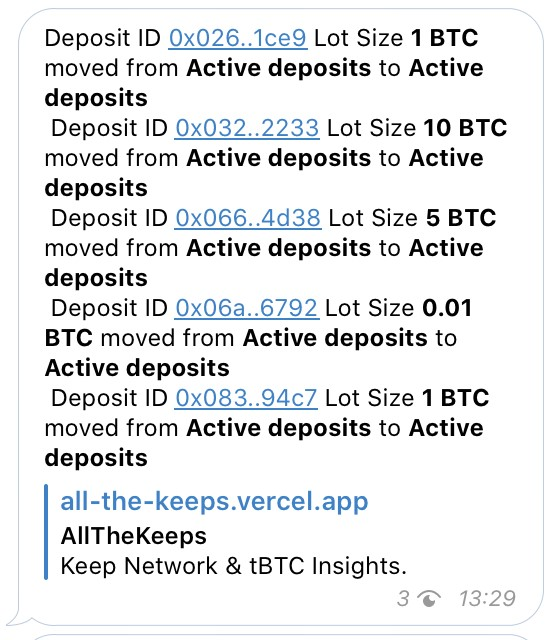
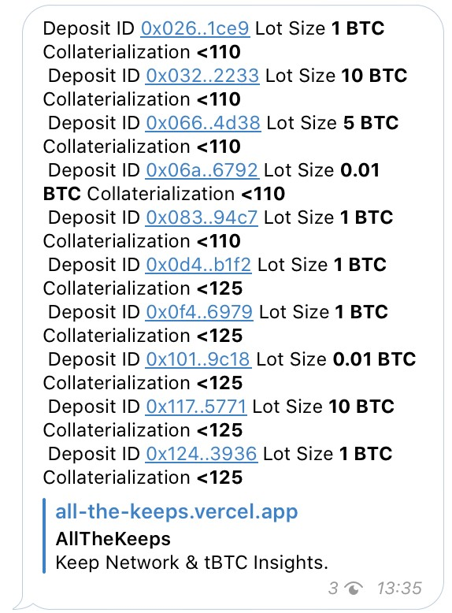
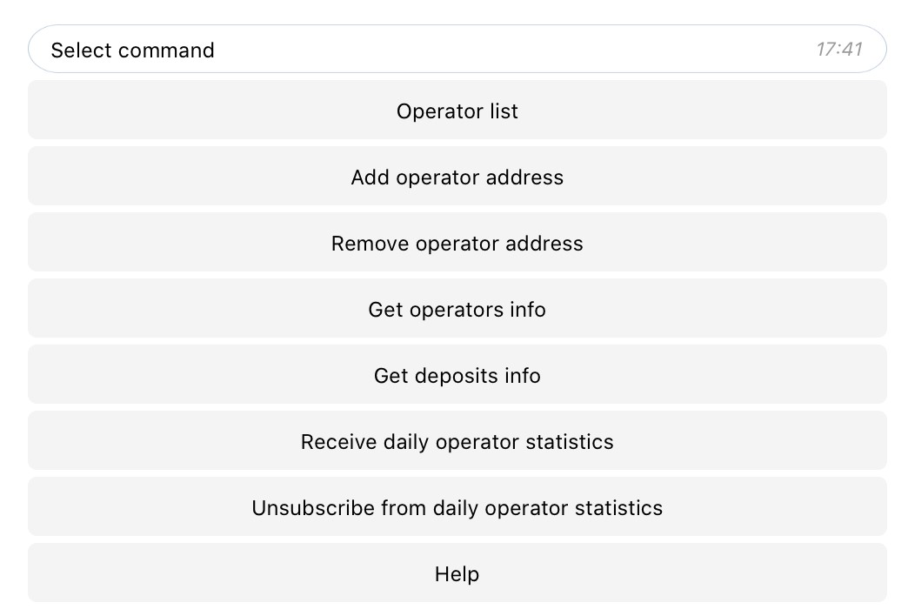
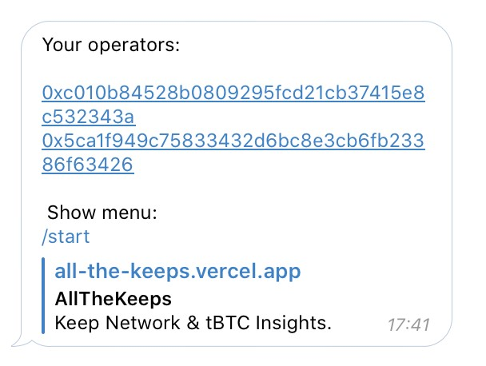
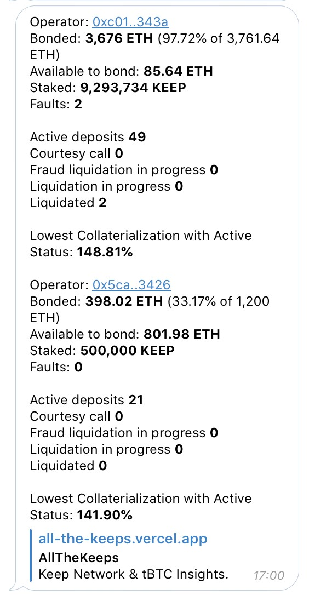
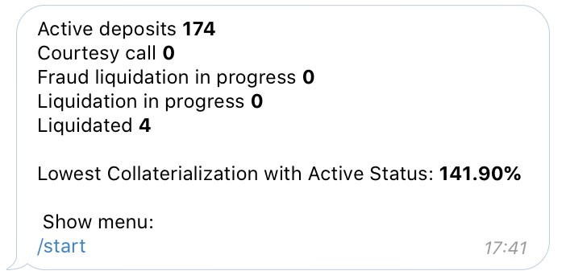
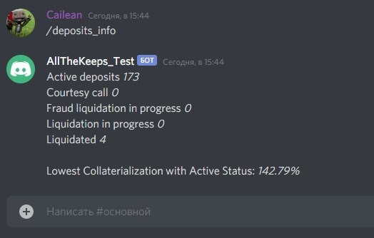
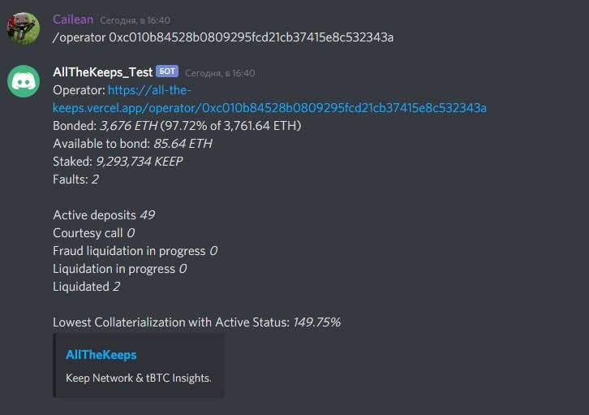

[Описание на английском](README.md)

# [Telegram channel](https://t.me/tbtcliquidationsinfo)

Предназначен для получения мгновенной информации о изменениях статусах депозитов и достижении ими пороговых значений Collaterialization для всех депозитов в систем

-	1 раз в сутки (15 UTC0) общая информация о депозитах

-	В слуаче изменения статуса любого депозита из всей системы (например, если депозит перешел из статуса Active в  Courtesy call), сообщает об этом мгновенно

-	В слуаче изменения % Collaterialization любого депозита из всей системы до пороговых значений (на текущий момент 125% и 110%), сообщает об этом мгновенно

# [Telegram bot](https://t.me/tBTC_Liquidationsbot)

Предназначен для получения мгновенной информации о изменениях статусах депозитов и достижении ими пороговых значений Collaterialization для всех депозитов выбранных операторов

- В случае изменения статуса депозита принадлещажему любому оператору из списка пользователя (например, если депозит перешел из статуса Active в  Courtesy call), сообщает об этом мгновенно

-	В слуаче изменения % Collaterialization депозита принадлещажему любому оператору из списка пользователя  до пороговых значений (на текущий момент 125% и 110%), сообщает об этом мгновенно

## Commands 

- /start - Выводит главное меню

- /operator_list - Выводит список операторов пользователя

- /add_operator - Добавить оператора в список
- /remove_operator - Убрать оператора из списка
- /operators_info - Получить краткую информацию по операторам пользователя

- /deposits_info - Получить общую информацию о депозитах в системе

- /statistics_on - Подписаться на ежедневную (в 15 UTC+0) информационную рассылку о состоянии оператора и депозитов
- /statistics_off - Отписаться от рассылки

# Discord bot

- выдает общую информация о депозитах по запросу

- выдает общую информацию о операторе по запросу 

